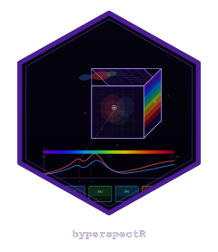

# hyperspectR 

<!-- badges: start -->
[](https://github.com/r-heller/hyperspectR/actions/workflows/R-CMD-check.yaml)
<!-- badges: end -->

**hyperspectR** provides a complete R pipeline for biomedical hyperspectral
imaging analysis -- from raw camera data to clinical tissue oxygenation
maps.

## Installation

```r
# install.packages("remotes")
remotes::install_github("r-heller/hyperspectR")
```

## Quick Start

```r
library(hyperspectR)

# Load example cube (synthetic 30x30 tissue scene, 61 bands, 430-910 nm)
cube <- hs_example_cube()
print(cube)

# Plot RGB composite
autoplot(cube, type = "rgb")

# Compute tissue oxygenation
sto2 <- hs_sto2(cube)
hs_plot_index(sto2, title = "StO2 (%)", palette = "sto2")

# Clinical 5-panel display (TIVITA-style)
hs_plot_clinical(cube)

# Launch interactive explorer
hs_run_app(cube)
```

## Features

- **I/O**: Read ENVI, multi-channel TIFF, and Cubert .cu3s files
- **Calibration**: Dark correction, white reference normalization, bad pixel repair
- **Preprocessing**: Savitzky-Golay smoothing, SNV, MSC, spectral derivatives
- **Biomedical indices**: StO2, NPI, THI, TWI, custom normalized difference indices
- **Analysis**: PCA, MNF, SAM classification, SVM/RF pixel classification, Beer-Lambert unmixing
- **Visualization**: ggplot2-based spectral plots, clinical panel displays, interactive Shiny app
- **Clinical focus**: Intraoperative oxygenation mapping, compartment syndrome assessment

## License

MIT
