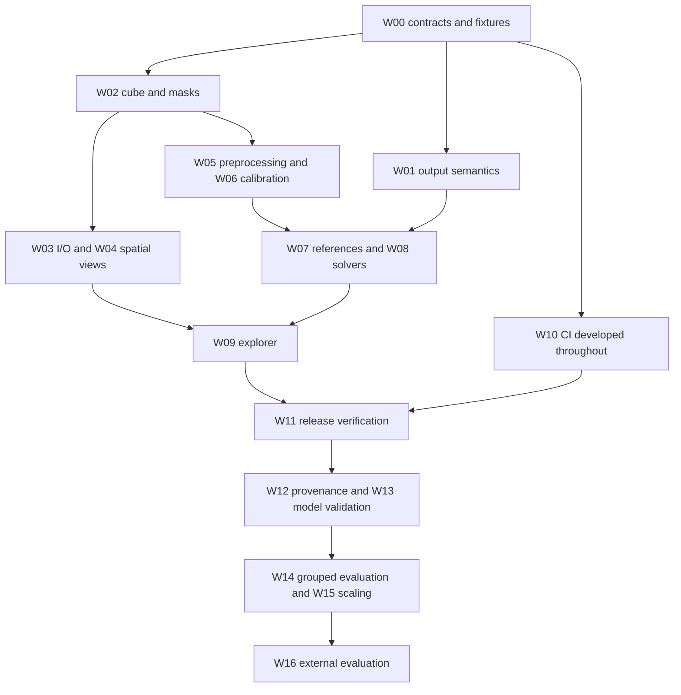

# hyperspectR development roadmap

**Planning baseline:** 2026-09-10, version 0.1.0, audited commit `d4fb6ab81176c0704797f31b4c7f1a9a7cb35d73`.

**Objective:** deliver reproducible hyperspectral research workflows whose spatial coordinates, spectral units, numerical results, and stated interpretation can be verified independently.

The development implementation now addresses all 25 confirmed audit findings and adds batch recipes, grouped evaluation, synthetic sensitivity analysis and responsive explorer jobs. The work-package descriptions below preserve the planned acceptance criteria. Verified changes and outstanding release, hardware and study gates are tracked in [the implementation record](planning/implementation-status.md) and [analysis results](planning/analysis-results.md). Estimates remain planning ranges; they are not measured effort or delivery commitments.

Supporting documents:

- [Audit baseline and all 25 findings](planning/audit-baseline.md)
- [Detailed analytical validation plan](planning/analysis-validation.md)

## 1. Delivery strategy and assumptions

The first release milestone repairs the existing package and makes its scientific claims match the available evidence. Independent model validation and study-level evaluation follow. New algorithms, camera integrations, and interface redesigns follow these foundations.

Assume one R maintainer with four planned engineering days per week, plus access to an optical-methods reviewer and a statistician. These are roles awaiting assignment, not confirmed staffing. One person may cover several roles, but review time still needs capacity.

Core stabilization, W00–W11, is estimated at **32–54 engineering days**, or **8–14 working weeks** at that capacity, before contingency and waits for scientific review. Budget roughly **10–17 weeks with 20% contingency**. Subsequent research work, W12–W16, adds **20–34 engineering days**; acquisition and independent review time are additional and currently unestimated. The engineering estimates include regression tests and work-package documentation; W10 adds CI integration, and W11 adds release-wide validation and migration documentation.

If capacity is smaller, retain the dependencies and move dates. Scientific evidence requirements do not become optional to meet a calendar target. Methods without adequate evidence can remain unavailable or explicitly experimental while the corrected engineering core is released.

## 2. Roadmap at a glance

| Horizon | Milestone | Deliverable | Exit requirement |
|---|---|---|---|
| Now | M0: contracts and evidence | Durable reproductions, output semantics, data invariants, regression CI started | W00 and W01 complete; every finding has an owner and acceptance test |
| Now → Next | M1: correct computational core | Verified I/O, dimensions, plotting, calibration, preprocessing, fitting and masks | W02–W08 complete; exact-value and independent numerical checks pass |
| Next | M2: stable research release | Working explorer, dependable exports, migration guide, release checks | W09–W11 complete; all 25 findings closed by tests or explicit removal of unsupported behavior |
| Next → Later | M3: reproducible analysis studies | Batch provenance, model comparisons, grouped classifier evaluation, performance baseline | W12–W15 complete; published evaluation bundle and reproducible results |
| Later, evidence-dependent | M4: externally evaluated methods | Camera/phantom/study validation with a frozen protocol | W16 complete for each claimed use case; independent review documents supported scope |

The working version is 0.2.0.9000; no release has been published. Corrected pixels, spectra, and indices differ from previous output. See the [migration guide](MIGRATION.md) before re-running historical analyses.

This graph shows the main sequence. The work-package table supplies the complete dependencies; work sharing a dependency may overlap if capacity permits.

## 3. Prioritized work packages

Roles: **M** package maintainer; **O** optical-methods reviewer; **S** statistician; **D** dataset/acquisition lead; **Q** independent code/test reviewer. The first role is accountable. All assignments are **TBD**.

| ID | Priority / milestone | Work package | Owner roles | Effort | Dependencies | Audit findings |
|---|---|---|---|---|---|---|
| W00 | Must / M0 | Contracts, durable fixtures, audit tracking | M, Q | 2–3 days | None | All |
| W01 | Must / M0 | Correct output names, interpretation, migration policy | O, M | 2–4 days | W00 | F01, F05, F06 |
| W02 | Must / M1 | Cube invariants, dimensions and mask behavior | M, Q | 3–5 days | W00 | F07, F16, F21 |
| W03 | Must / M1 | Binary validation and interoperable I/O | M, Q | 3–5 days | W02 | F04, F08, F17, F23 |
| W04 | Must / M1 | Spatial/spectral visualization correctness | M, Q | 2–3 days | W02 | F03, F20, F21 |
| W05 | Must / M1 | Deterministic preprocessing across backends | M, O | 3–5 days | W02 | F02, F13 |
| W06 | Must / M1 | Calibration and detector-quality handling | M, O | 2–4 days | W02 | F15, F18, F19 |
| W07 | Must / M1 | Reference spectra and explicit spectral domains | O, M | 4–6 days | W01, W02 | F05, F06 |
| W08 | Must / M1 | Solvers, reduction and fit diagnostics | M, O, Q | 3–5 days | W02, W05, W06, W07 | F07, F14, F22 |
| W09 | Must / M2 | Explorer state, uploads, errors and exports | M, Q | 3–5 days | W01, W03, W04, W05, W08 | F09, F10, F11, F12, F24, F25 |
| W10 | Must / M2 | Regression matrix and CI gates | M, Q | 3–5 days | Start after W00; finish after W02–W09 | All |
| W11 | Must / M2 | Migration documentation and release evidence | M, O, Q | 2–4 days | W01–W10 | All |
| W12 | Should / M3 | Reproducible batch analysis and provenance | M, D | 3–5 days | W11 | Analysis improvement |
| W13 | Should / M3 | Independent model and sensitivity evaluation | O, M, S | 5–8 days | W07, W08, W12 | Analysis improvement |
| W14 | Should / M3 | Grouped classification and ROI inference | S, M, D | 4–6 days | W08, W12; suitable labels | Analysis improvement |
| W15 | Should / M3 | Profile and scale representative workflows | M, Q | 3–5 days | W12; validated baselines from W13 | Project improvement |
| W16 | Evidence-dependent / M4 | Phantom, camera and external study evaluation | O, D, S | 5–10 engineering days | W13, relevant W14 outputs; independent data | Analysis improvement |

### W00 — Establish contracts and preserve evidence

Convert the audit examples into small permanent fixtures and regression cases as each fix is developed. Store scripts, source identifiers, checksums, and expected values in the repository; tests must not depend on temporary audit paths or a live website. Keep large recordings outside the package with a documented fixture-generation process.

Write contracts for `data[row, column, band]`, plotted `(x=column, y=row)`, wavelength/FWHM units, spectral domain, invalid pixels, missing values, calibration compatibility, and result dimensions. Record deliberate exceptions, such as methods estimating a reference spectrum from all valid pixels.

**Done when:** F01–F25 each have a reproducer, acceptance criterion, owner role, and planned fix/removal; fixture values come from an independent construction or calculation. The fixture registry distinguishes algebraic examples, simulated tissue, vendor examples, and real measurements.

### W01 — Make scientific output semantics explicit

Remove image-percentile stretching from computational index values. Introduce an explicitly relative band-index API if useful; reserve stretching for display. Require an explicit migration path for `hs_sto2(method="ratio")`, rather than retaining an oxygen-saturation label on arbitrary contrast values. Determine the valid physical interpretation of each remaining index, especially when required bands are absent.

Inventory labels and claims in exported functions, help files, the explorer, README, and vignettes. Replace unsupported clinical cutoffs with descriptions appropriate to the demonstrated method. Define which outputs are relative indices, model-based research estimates, or externally validated measurements. Use a clear error for unavailable quantitative methods rather than silently falling back to an unrelated index.

**Done when:** an unchanged spectrum has the same numerical index in different scenes; a uniform spectrum does not imply 50% oxygenation; exported maps identify method and units; migration examples explain changed results. A quantitative method's numerical availability and its empirical validation status are recorded separately.

### W02 — Enforce cube and mask invariants

Centralize array-to-pixel-matrix conversion, reconstruction, and extraction of spatial band matrices. Preserve one-row, one-column, and one-pixel dimensions. Reject empty dimensions, nonfinite/duplicate wavelengths, invalid FWHM, malformed masks, and incompatible label matrices with specific messages. Define any supported unsorted input by sorting all band metadata consistently. Represent unknown wavelength metadata explicitly rather than interpreting band indices as nanometers in analytical functions.

Apply cube validity masks before global statistics, model fitting and ROI summaries; intersect ROI/training masks with cube validity. Handle per-band missingness through a documented method policy. Preserve original pixel locations and place NA/reason codes in unusable output locations. An invalid pixel must not crash otherwise valid analysis.

**Done when:** source ↔ matrix ↔ reconstructed cube preserves exact coordinates; masked-outlier changes leave valid-only statistics unchanged; all-invalid and insufficient-data cases have defined outputs; every exported spatial result follows its dimension contract.

### W03 — Make I/O fail clearly and interoperate

Validate ENVI headers, offsets, dimensions, interleave, types, units and expected byte counts before allocation and reading. Check exact payload length after reading. Prevent header files from being selected as binary companions. Resolve legitimate extensionless data explicitly and test ambiguous layouts. Choose and document the policy for trailing bytes.

Correct terra cell-order conversion in both readers and the TIFF writer. Test source and destination orientation independently with asymmetric fixtures. Convert FWHM units with wavelengths. Support wide integer types only where the internal representation can preserve the required values; otherwise reject them before creating output. Values beyond exact double precision require a separate design, not a wider `readBin()` size alone.

**Done when:** BSQ/BIL/BIP and both endian variants match independent expected arrays; TIFF exports match an external reader; partial/corrupt files fail; subset coordinates are correct; invalid writes do not leave misleading completed-looking outputs.

### W04 — Restore coordinate and wavelength fidelity in plots

Use W02 conversion helpers in band, RGB, index, component and spectrum displays. Correct the random-spectrum wavelength assignment. Preserve spatial masks in display and define NA colors. Validate RGB behavior for supported input domains and ranges. Make plot units reflect the actual spectral domain.

**Done when:** an asymmetric scene agrees across array access, plotted values, cursor selection, ROI selection and export; every random spectrum follows the full wavelength grid. Test plot data numerically; use visual snapshots only for a few stable layout checks.

### W05 — Make preprocessing mathematically consistent

Declare common SG edge handling and returned wavelength centers. Expose a deterministic backend selection for reproducibility or select one canonical implementation; adding an optional dependency must not silently alter meaning. Align FWHM with output bands and fix derivative orientation. Define derivative units using wavelength spacing; reject irregular grids for the uniform-spacing method or resample through an explicit recorded step.

Specify handling of incomplete spectra without replacing arbitrary missing values with zero. Record transformations in processing history. Distinguish per-spectrum transforms from learned transforms such as a cube-wide MSC reference; learned parameters must be reusable on other cubes without refitting.

**Done when:** constant, linear and polynomial spectra give expected interior values/derivatives; backend outputs agree on common support within declared tolerance; edge differences are explicit; unsupported combinations fail rather than recycle data.

### W06 — Validate calibration and detector correction

Require matching reference dimensions, wavelengths and compatible acquisition metadata when available. Make missing acquisition metadata visible as an unresolved compatibility check. Define any allowed reference broadcasting precisely. Detect near-zero/negative white-minus-dark denominators and saturation with reason masks, rather than converting all such pixels to plausible clamped values. Preserve an unclamped calibrated result for QC; clipping policy must be explicit.

Exclude the center and invalid neighbors from bad-pixel replacement. Handle zero-variance neighborhoods, image borders, adjacent defects and insufficient valid neighbors. Return a repair mask and counts; ensure repair order does not accidentally change results.

**Done when:** known dark/white examples recover reflectance; mismatched references are rejected; all detector edge cases have exact expected values; the repaired image and its QC mask can be inspected separately.

### W07 — Use traceable spectra and explicit input domains

Create a versioned reference-data registry with provenance, redistribution status, original units, conversions, interpolation support and checksums. Start with HbO2/Hb. Include water, melanin and metHb in quantitative fitting only after their parameter definitions and unit conventions are resolved. Keep generated Gaussian examples separate from measurement reference data.

Replace numeric-range detection with explicit domain metadata/arguments. Mark `-log10(reflectance)` as apparent absorbance where appropriate. Represent known path length, unknown path-length products and relative coefficients distinctly. Model sensor spectral response using available response curves or an explicitly documented approximation; interpolation of peak centers alone is not proof of adequate instrument modeling.

**Done when:** reference values match a pinned independent source; reflectance and equivalent absorbance yield the same fit; repeated conversion is detected; unsupported domains and wavelength coverage fail clearly. Synthetic coefficient-recovery tests pass independently of `hs_simulate_cube()`.

### W08 — Strengthen solvers and dimensionality reduction

Implement a true nonnegative equality constraint for sum-to-one unmixing. Validate backend and fallback behavior against independent solutions, including rank deficiency and scale changes. Return convergence/validity information, residual diagnostics, active constraints, wavelength support, and conditioning warnings. Identify unobservable coefficients rather than reporting false precision.

Limit PCA by actual sample rank and validate MNF noise-estimation requirements for narrow images, singular covariance and invalid neighbors. Provide transformation parameters for applying trained reductions to held-out data. Keep stochastic methods reproducible through explicit seeds. Treat UMAP as exploratory; its coordinates are not quantitative tissue measurements.

**Done when:** constrained abundance sums, solver optimality checks and reconstructions meet the numerical gates in the validation plan; small/degenerate datasets have specified outcomes; masks do not change pixel correspondence.

### W09 — Repair the full explorer workflow

Fix UI construction first so subsequent changes can be exercised in a real browser. Initialize supplied cubes once. Associate every result with cube identity, processing revision, method and parameters; invalidate or explicitly mark stale results after relevant changes. Bind labels and units to stored results.

Support ENVI header/binary uploads in one controlled workspace, TIFF wavelength entry, and complete ENVI archive downloads. Constrain any archive extraction to that workspace and reject ambiguous entries. Clean up session files. Route UI operations through the same package functions as scripted analysis. Validate controls before execution and handle expected errors without ending the session. Reset cursor/ROI state when dimensions change; implement or remove inert controls.

**Done when:** browser tests cover both initial-cube modes, supported uploads, missing/invalid input, processing, reset, index switching, cube replacement, pixel selection and independent opening of downloaded results. A stale computation cannot overwrite newer state.

### W10 — Make CI measure the relevant behavior

Start CI integration with W00 and extend it alongside fixes. Keep a fast deterministic contract suite on every change, a dependency/backend matrix, package checks on supported operating systems, and a real explorer smoke test. Exercise both the actual minimal dependency environment and the supported optional backends. Ensure the declared R minimum is covered or update it deliberately after compatibility review.

Add an explicit F01–F25 regression inventory. Establish a tests-only coverage baseline and enable a nonzero floor after useful assertions exist; select the number from the measured baseline rather than inventing a coverage percentage target. Include Shiny modules in relevant instrumentation or report their coverage separately. Make semantic checks blocking even if cosmetic lint remains report-only during cleanup.

Shared workflow changes belong in `CTTIR/.github`; use caller options here where available. Do not copy shared steps back into this repository. Archive logs, fixture versions and benchmark outputs with release checks.

**Done when:** a deliberate reintroduction of each defect is caught by an assertion; mandatory jobs are explicit and passing; missing hardware evidence is distinguished from an SDK mock; installing/removing optional backends cannot change results unnoticed.

### W11 — Release with a migration and evidence record

Rewrite examples around corrected APIs and semantics. Include explicit domains, mask handling, instrument support, relative-versus-quantitative outputs, and batch reproducibility. Regenerate help and the website. Include before/after examples for spatial order, smoothing support, fitting and indices so users can assess previously saved results. Preserve historical results with their version and provenance; do not silently relabel them as corrected measurements.

**Done when:** all 25 findings have test-backed closure or documented removal; package checks, browser scenarios, reference calculations and migration examples pass; reviewers can locate the evidence for every retained quantitative claim. Choose the release version and publish only through the established maintainer workflow.

### W12–W16 — Improve analysis beyond the repaired baseline

| Package | Concrete deliverable | Acceptance condition |
|---|---|---|
| W12 | Manifest-driven batch execution, saved processing recipes, structured results and per-recording failure records | A fresh session reproduces a prior run from input identifiers, parameters and pinned environment; one bad recording does not erase completed results |
| W13 | Independent Hb fitting benchmark; sensitivity to spectral response, noise, calibration, scattering, band selection and regularization | Report all predefined cases, failed fits, bias, uncertainty and coverage; a frozen configuration is evaluated on untouched holdout data |
| W14 | Reusable training/prediction objects, subject/session/site splits, ROI-level summaries and repeated-measures inference | No subject leakage; preprocessing is fitted within training folds; metrics and intervals reflect the unit of inference |
| W15 | Measured runtime/peak-memory baseline; chunked computation where beneficial; optional residual materialization; responsive long-running app jobs | Chunked and full outputs agree; masks/coordinates and global estimates remain consistent across chunk sizes; performance claims name hardware and dimensions |
| W16 | Independent instrument/phantom/study evaluation with matched references, acquisition QC and prespecified endpoints | The frozen analysis meets thresholds selected before holdout evaluation for the stated use case, or the report explicitly limits/rejects that claim |

Implementation details, datasets, model assumptions, metrics and stopping rules are in the [analytical validation plan](planning/analysis-validation.md).

## 4. First implementation wave

The first wave is approximately **5–8 engineering days**, drawn from the work-package estimates rather than added to them. It is not expected to resolve all audit findings.

1. **PR 1: evidence and contracts.** Start W00, freeze asymmetric spatial and independent spectral fixtures, define dimensions/masks/domains, and attach findings to tests. Include the deterministic app-construction regression so the explorer failure becomes visible.
2. **PR 2: output semantics.** Implement W01's decisions with migration errors/labels and the affected examples. Remove scene-stretched saturation claims before restoring a quantitative pathway.
3. **PR 3: cube and I/O corruption.** Start W02/W03 with spatial order, single-dimension handling, metadata alignment and strict ENVI lengths. Add independent read/write tests in the same changes.
4. **PR 4: SG correctness.** Implement W05's center/edge contract and derivative orientation. Verify the exact polynomial fixtures across available backends.

Subsequent PRs follow the dependencies in the table. The small UI construction fix can be merged early with its regression test, but a working startup alone does not satisfy M2.

## 5. Release gates and progress tracking

| Measure | Audit baseline | M2 target | M3/M4 target |
|---|---|---|---|
| Open confirmed findings | 12 P1 + 13 P2 | 0, or affected feature explicitly removed with migration documentation | No regression |
| Spatial and spectral fixture checks | Missing exact-value coverage in critical paths | All mandatory fixtures pass on supported backends | Extended to instrument-specific fixtures |
| Data integrity | Truncated ENVI accepted; wide integers lossy | Invalid input rejected; supported types independently verified | Acquisition-level integrity and provenance reports |
| Scientific reference recovery | Independent 70% example returns about 53% | Noiseless solver/reference tests meet algebraic tolerance | Separate empirical accuracy thresholds met for each validated scope |
| Mask consistency | Invalid pixels affect outputs | Required invariance and failure-isolation tests pass | QC yield and exclusion reasons reported per study |
| Explorer workflows | UI fails during construction | Real-browser scenario suite passes | Large-job completion/cancellation and result provenance verified |
| CI coverage | Green package check despite defects; floor 0 | Numeric regressions are blocking; measured nonzero coverage floor | Study/benchmark fixtures versioned and evaluated on releases |
| Model evaluation | No independent validation bundle established by the audit | Claims restricted to demonstrated evidence | Frozen held-out evaluation with uncertainty and limitations |

At each implementation review, update status, actual effort, evidence links, unresolved decisions and downstream dependencies. Mark a finding closed only after its old behavior fails the new regression and corrected behavior passes. Review roadmap changes at milestone boundaries or when evidence invalidates an assumption.

## 6. Decisions and external dependencies

| Decision/dependency | Accountable role | Resolve by | Default/contingency |
|---|---|---|---|
| Intended use and supported output semantics | O + M | W01 | Corrected research workflows; no inferred clinical thresholds |
| Reference-data redistribution and unit compatibility | O | W07 | Ship only resolved sources; other chromophores remain unavailable for quantitative fitting |
| Availability of calibrated recordings and sensor response data | D + O | W13 planning | Use explicit response approximations for sensitivity studies; withhold device-specific accuracy claims |
| Appropriate independent measurement and study precision | S + O | W16 protocol freeze | No fixed empirical accuracy threshold or sample count until endpoint and reference uncertainty are specified |
| Real Cubert/TIVITA integration access | D + M | M2 support review | Document fixture/mock-tested support separately; schedule real-session tests before expanding claims |
| Minimum R and dependency versions | M | W10 | Test the declared minimum or change the requirement with a migration note |
| Large-cube capacity target | M + D | W15 | Select actual acquisition sizes and reference hardware before promising latency/memory targets |

## 7. Deferred scope

Additional classifiers, deep-learning segmentation, automated clinical decisions, new device families, and broad UI redesign are deferred until M2. Prefer strengthening the existing PCA/MNF/SAM/SVM/RF/unmixing workflows over increasing algorithm count. Parallel hardware acceleration follows a measured bottleneck and a verified numerical baseline. A clinical deployment program would require its own scope, evidence and implementation plan; M2 and M3 do not imply that milestone.
