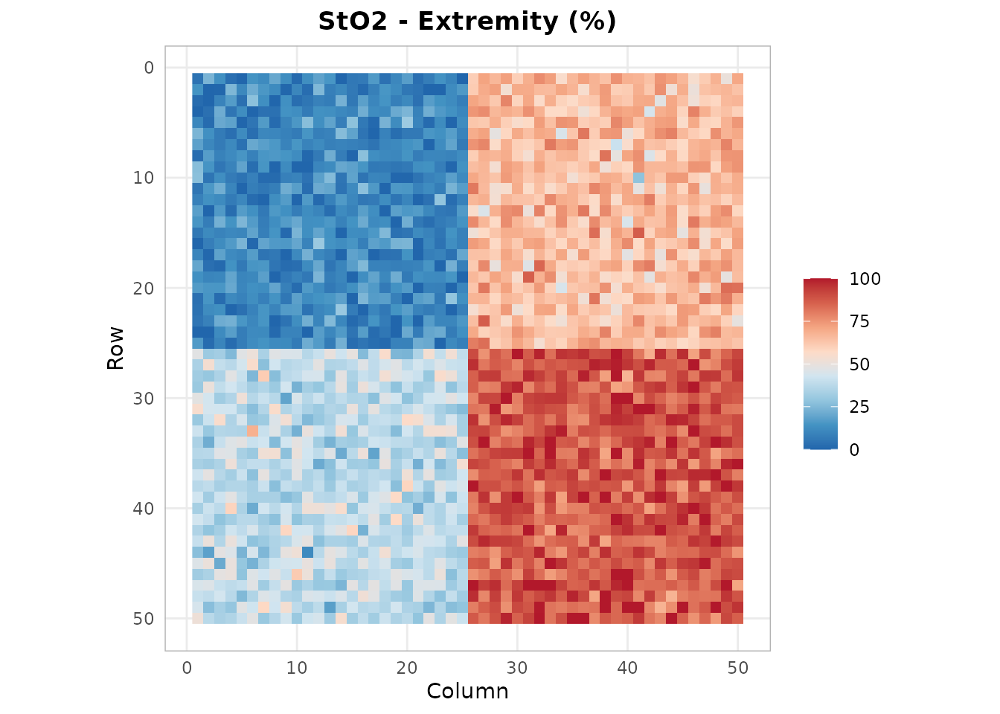
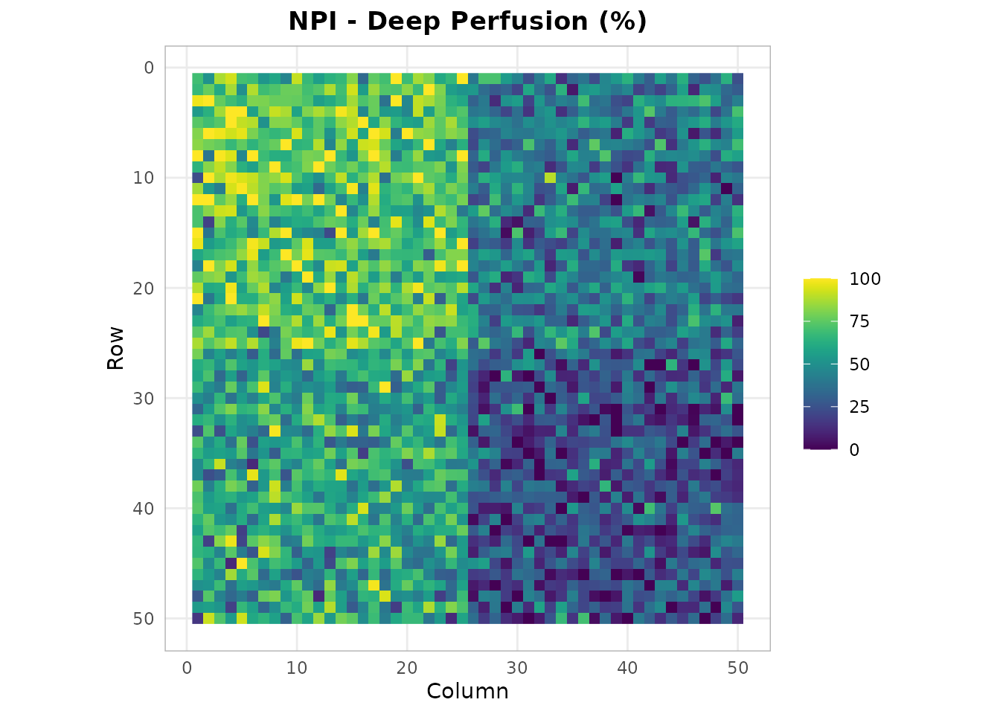
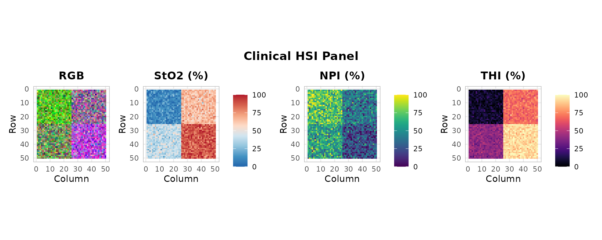
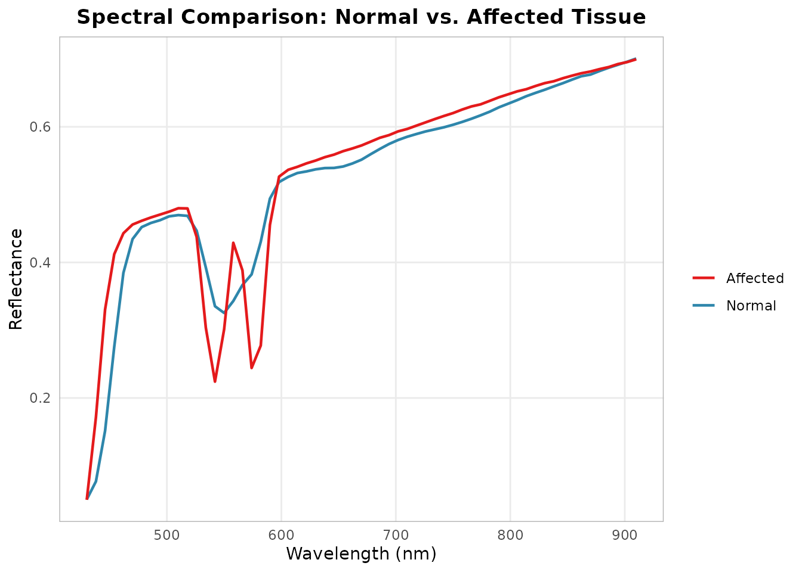

# Compartment Syndrome HSI Assessment

[](https://github.com/CTTIR/hyperspectR/actions/workflows/R-CMD-check.yaml)
[](https://cttir.github.io/hyperspectR/)
[](https://CRAN.R-project.org/package=hyperspectR)
[](https://app.codecov.io/gh/CTTIR/hyperspectR?branch=main)
[](https://cran.r-project.org/package=hyperspectR)
[](https://cran.r-project.org/package=hyperspectR)
[](https://opensource.org/licenses/MIT)
[](https://lifecycle.r-lib.org/articles/stages.html#experimental)

``` r

library(hyperspectR)
#> hyperspectR v0.1.0 - Hyperspectral Imaging Analysis for Biomedical Applications
```

## Clinical Background

Acute compartment syndrome (ACS) is a surgical emergency where increased
pressure within a closed muscle compartment compromises tissue
perfusion. Traditional diagnosis relies on clinical assessment and
invasive intra- compartmental pressure (ICP) measurement.

Hyperspectral imaging offers a non-invasive alternative by quantifying
tissue oxygenation through the skin surface, enabling spatial mapping of
perfusion compromise.

## Simulating an Extremity Scene

We simulate a tissue scene with a region of reduced oxygenation
representing compartment syndrome:

``` r

cube <- hs_simulate_cube(rows = 50, cols = 50, n_regions = 4,
                          sto2_range = c(0.15, 0.9), seed = 123)
```

## Tissue Oxygenation Mapping

``` r

sto2 <- hs_sto2(cube)
hs_plot_index(sto2, title = "StO2 - Extremity (%)", palette = "sto2")
```



Regions with StO2 below 40% may indicate critical ischemia.

## Perfusion Assessment

``` r

npi <- hs_npi(cube)
hs_plot_index(npi, title = "NPI - Deep Perfusion (%)", palette = "perfusion")
```



## Clinical Panel Overview

``` r

hs_plot_clinical(cube, indices = c("sto2", "npi", "thi"))
```



## ROI Comparison: Affected vs. Unaffected

``` r

roi_affected <- hs_roi_rect(cube, x_range = c(30, 50), y_range = c(30, 50))
roi_normal <- hs_roi_rect(cube, x_range = c(1, 20), y_range = c(1, 20))

stats_aff <- hs_roi_stats(cube, roi_affected)
stats_norm <- hs_roi_stats(cube, roi_normal)

library(ggplot2)
ggplot() +
  geom_line(data = stats_norm,
            aes(x = wavelength, y = mean, color = "Normal"), linewidth = 0.8) +
  geom_line(data = stats_aff,
            aes(x = wavelength, y = mean, color = "Affected"), linewidth = 0.8) +
  scale_color_manual(values = c(Normal = "#2E86AB", Affected = "#E41A1C")) +
  labs(x = "Wavelength (nm)", y = "Reflectance",
       title = "Spectral Comparison: Normal vs. Affected Tissue", color = "") +
  theme_hsi()
```



The affected compartment shows reduced reflectance in the visible range
(increased Hb absorption) and altered spectral shape, consistent with
venous congestion and tissue deoxygenation.
