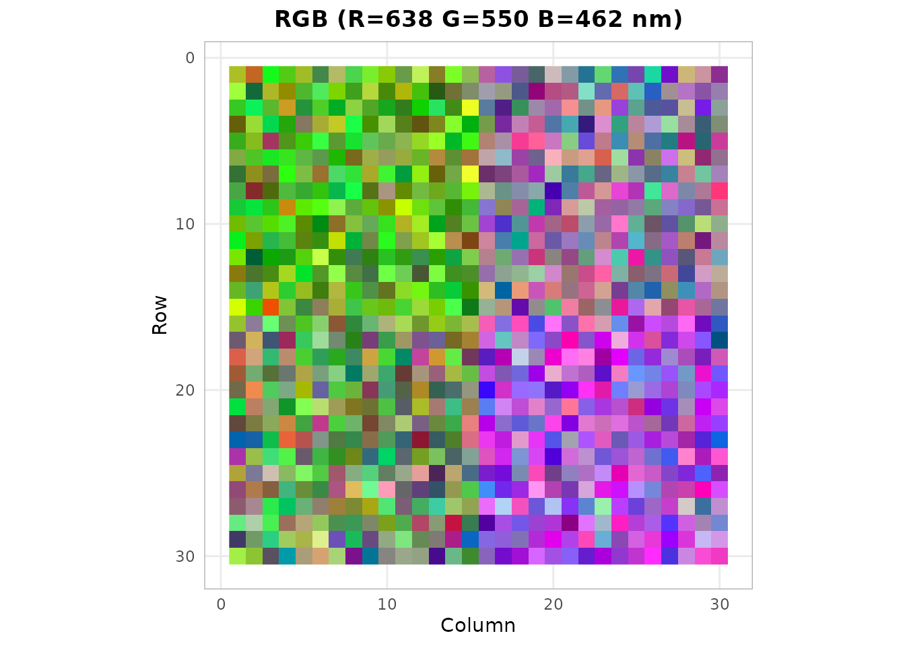
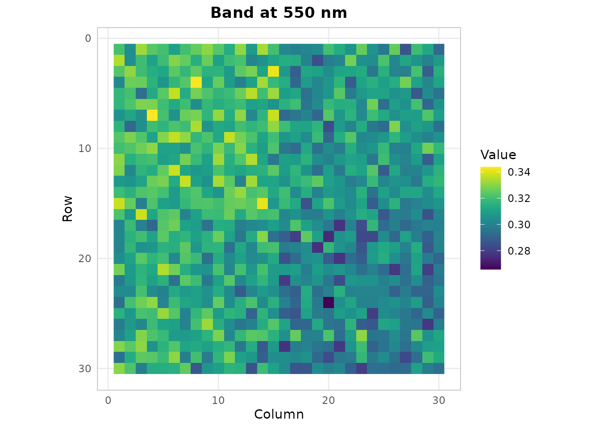
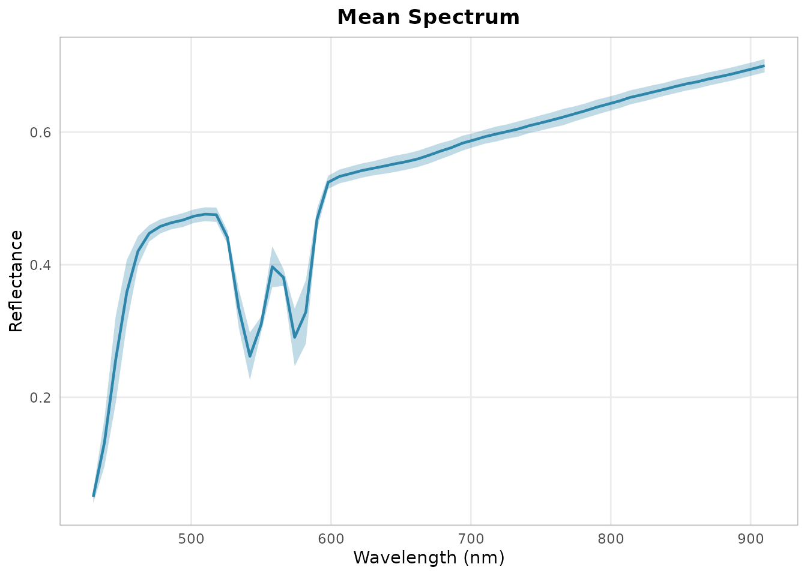
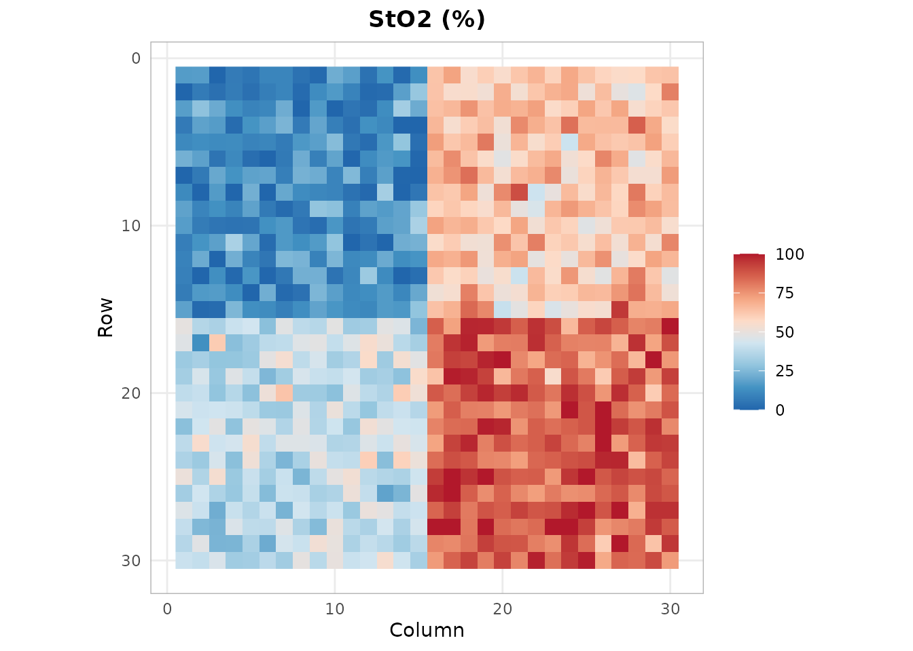
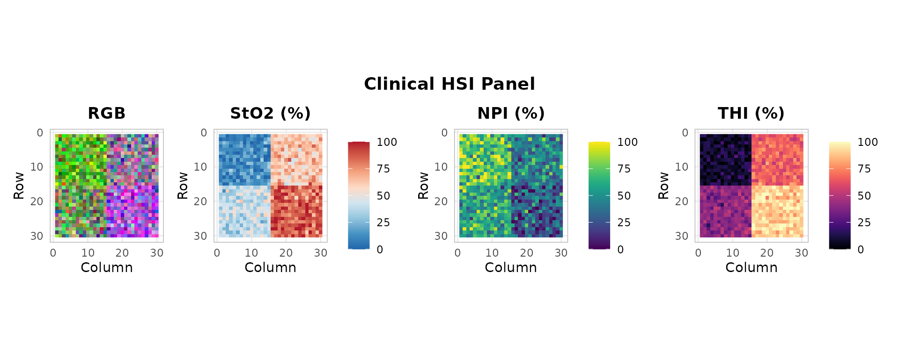

# Getting Started with hyperspectR

[](https://github.com/CTTIR/hyperspectR/actions/workflows/R-CMD-check.yaml)
[](https://cttir.github.io/hyperspectR/)
[](https://CRAN.R-project.org/package=hyperspectR)
[](https://app.codecov.io/gh/CTTIR/hyperspectR?branch=main)
[](https://cran.r-project.org/package=hyperspectR)
[](https://cran.r-project.org/package=hyperspectR)
[](https://opensource.org/licenses/MIT)
[](https://lifecycle.r-lib.org/articles/stages.html#experimental)

### Installation

``` r

# Install from GitHub
# install.packages("remotes")
remotes::install_github("cttir/hyperspectR")
```

### Loading the Package

``` r

library(hyperspectR)
#> hyperspectR v0.1.0 - Hyperspectral Imaging Analysis for Biomedical Applications
```

### Creating and Inspecting a Cube

hyperspectR provides synthetic data generators for testing and
demonstration.
[`hs_example_cube()`](https://cttir.github.io/hyperspectR/reference/hs_example_cube.md)
creates a 30x30 pixel tissue scene with 61 spectral bands spanning
430-910 nm:

``` r

cube <- hs_example_cube()
print(cube)
#> 
#> ── hsi_cube ────────────────────────────────────────────────────────────────────
#> Dimensions: 30 rows x 30 cols x 61 bands
#> Wavelengths: 430-910 nm (61 bands)
#> FWHM: 25 nm (mean)
#> Mask: 900/900 valid pixels (100%)
#> Data range: [0.0198, 0.7306]
#> Metadata: camera, processing_mode, acquisition_time, region_map,
#> sto2_ground_truth, seed
```

Check the dimensions:

``` r

dim(cube)
#> [1] 30 30 61
```

The summary provides per-band statistics:

``` r

s <- summary(cube)
s$wavelength_range
#> [1] 430 910
s$data_range
#> [1] 0.01982067 0.73056093
```

### Subsetting

You can subset cubes spatially and spectrally while preserving the
class:

``` r

sub <- cube[1:15, 1:15, 1:30]
dim(sub)
#> [1] 15 15 30
```

### Visualization

#### RGB Composite

``` r

ggplot2::autoplot(cube, type = "rgb")
```



#### Single Band Image

``` r

hs_plot_image(cube, wavelength = 550)
```



#### Mean Spectrum

``` r

hs_plot_spectra(cube, pixels = "mean", show_sd = TRUE)
```



### Computing Tissue Indices

The package implements clinical tissue indices used in surgical HSI:

``` r

sto2 <- hs_sto2(cube)
hs_plot_index(sto2, title = "StO2 (%)", palette = "sto2")
```



#### Clinical Panel Display

``` r

hs_plot_clinical(cube, indices = c("sto2", "npi", "thi"))
```



### Interactive Exploration

Launch the Shiny app for interactive analysis:

``` r

hs_run_app(cube)
```

### Next Steps

- Read real data with
  [`hs_read_envi()`](https://cttir.github.io/hyperspectR/reference/hs_read_envi.md)
  or
  [`hs_read_cube()`](https://cttir.github.io/hyperspectR/reference/hs_read_cube.md)
- Preprocess with
  [`hs_smooth()`](https://cttir.github.io/hyperspectR/reference/hs_smooth.md),
  [`hs_snv()`](https://cttir.github.io/hyperspectR/reference/hs_snv.md),
  [`hs_msc()`](https://cttir.github.io/hyperspectR/reference/hs_msc.md)
- Perform PCA with
  [`hs_pca()`](https://cttir.github.io/hyperspectR/reference/hs_pca.md)
  or MNF with
  [`hs_mnf()`](https://cttir.github.io/hyperspectR/reference/hs_mnf.md)
- Classify with
  [`hs_sam()`](https://cttir.github.io/hyperspectR/reference/hs_sam.md)
  or fit chromophores with
  [`hs_beer_lambert()`](https://cttir.github.io/hyperspectR/reference/hs_beer_lambert.md)

## Use of LLM tools

Portions of this package were prepared with assistance from large
language model tooling for narrowly defined, non-authorial tasks:
copyediting, prose smoothing, Markdown/LaTeX formatting, scaffolding of
boilerplate files (CI configs, build scripts), code refactoring. The
tools used were [Chat
AI](https://kisski.gwdg.de/leistungen/2-02-llm-service/), the LLM
service of KISSKI (GWDG), and a self-hosted **Mistral Small (24B,
Apache-2.0)** run locally via [Ollama](https://ollama.com/) and the
`ollamar` R package — local inference only, with no data sent to third
parties for the self-hosted model.

All scientific claims, methodological choices, analyses,
interpretations, and conclusions are the author’s own. No LLM-generated
text was incorporated without review and revision, and every reference
was verified against its DOI, arXiv ID, or ISBN.
