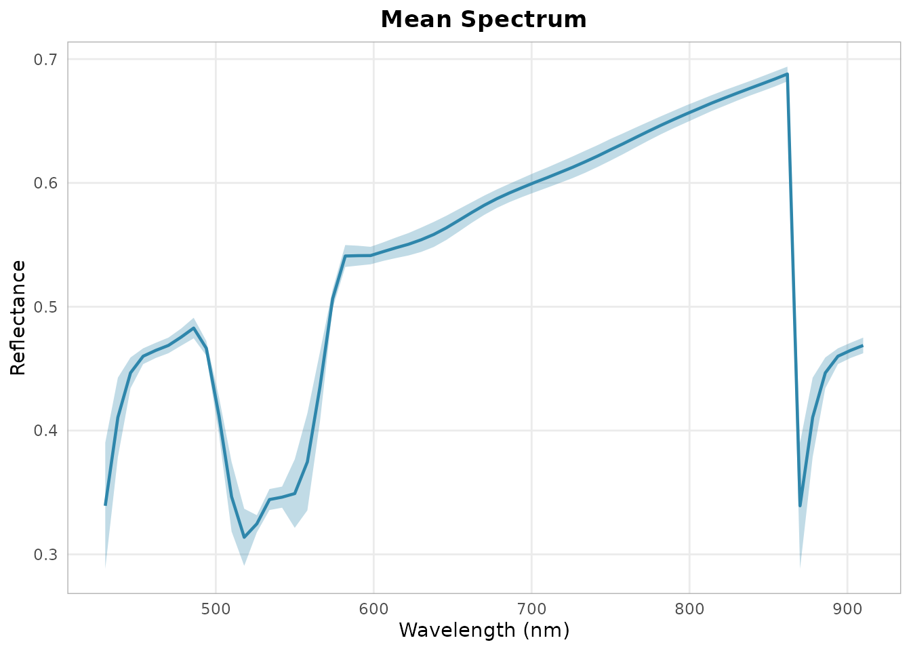
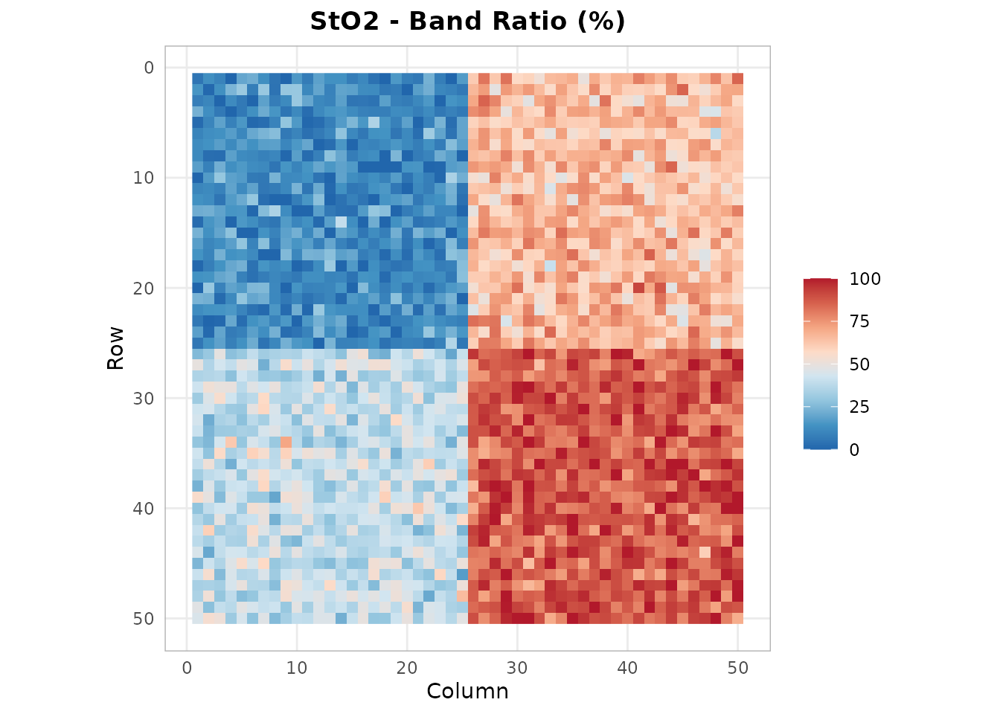
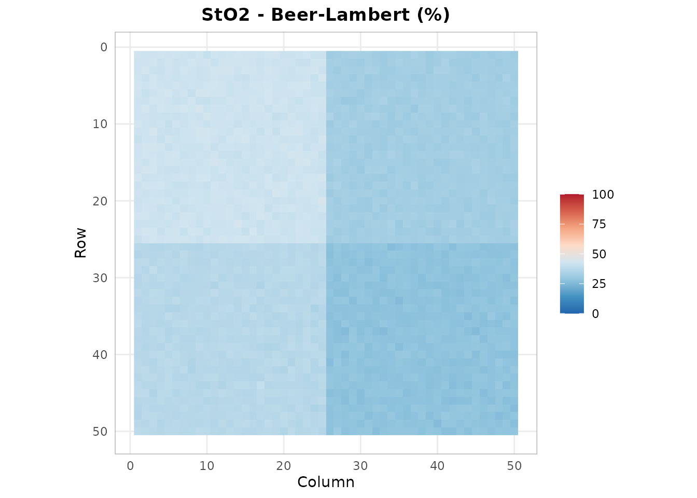
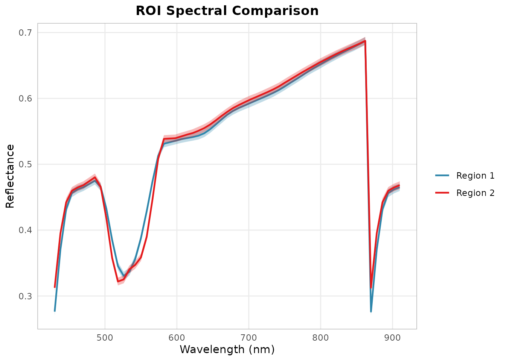
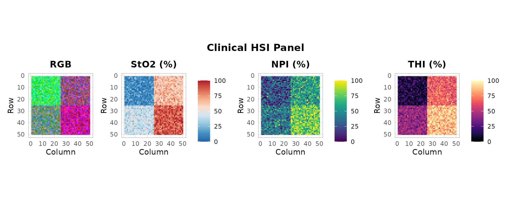

# Intraoperative Oxygenation Mapping

[](https://github.com/CTTIR/hyperspectR/actions/workflows/R-CMD-check.yaml)
[](https://cttir.github.io/hyperspectR/)
[](https://CRAN.R-project.org/package=hyperspectR)
[](https://app.codecov.io/gh/CTTIR/hyperspectR?branch=main)
[](https://cran.r-project.org/package=hyperspectR)
[](https://cran.r-project.org/package=hyperspectR)
[](https://opensource.org/licenses/MIT)
[](https://lifecycle.r-lib.org/articles/stages.html#experimental)

``` r

library(hyperspectR)
#> hyperspectR v0.1.0 - Hyperspectral Imaging Analysis for Biomedical Applications
```

## Overview

This vignette demonstrates how to use hyperspectR for intraoperative
tissue oxygenation assessment. We simulate a tissue scene and walk
through the complete analysis pipeline from raw data to
publication-quality figures.

## Step 1: Load Data

``` r

cube <- hs_simulate_cube(rows = 50, cols = 50, n_regions = 4,
                          sto2_range = c(0.2, 0.95), seed = 42)
print(cube)
#> 
#> ── hsi_cube ────────────────────────────────────────────────────────────────────
#> Dimensions: 50 rows x 50 cols x 61 bands
#> Wavelengths: 430-910 nm (61 bands)
#> FWHM: 25 nm (mean)
#> Mask: 2500/2500 valid pixels (100%)
#> Data range: [0.0163, 0.734]
#> Metadata: camera, processing_mode, acquisition_time, region_map,
#> sto2_ground_truth, seed
```

## Step 2: Preprocessing

``` r

smoothed <- hs_smooth(cube, window = 7, poly = 3)
hs_plot_spectra(smoothed)
```



## Step 3: Band-Ratio StO2

``` r

sto2_ratio <- hs_sto2(smoothed, method = "ratio")
hs_plot_index(sto2_ratio, title = "StO2 - Band Ratio (%)", palette = "sto2")
```



## Step 4: Beer-Lambert Chromophore Fitting

``` r

fit <- hs_beer_lambert(smoothed)
hs_plot_index(fit$sto2, title = "StO2 - Beer-Lambert (%)", palette = "sto2")
```



## Step 5: ROI-Based Statistical Analysis

``` r

# Define ROIs for different surgical field regions
roi_healthy <- hs_roi_rect(smoothed, x_range = c(1, 20), y_range = c(1, 20))
roi_ischemic <- hs_roi_rect(smoothed, x_range = c(30, 50), y_range = c(1, 20))

stats_healthy <- hs_roi_stats(smoothed, roi_healthy)
stats_ischemic <- hs_roi_stats(smoothed, roi_ischemic)

library(ggplot2)
ggplot() +
  geom_ribbon(data = stats_healthy,
              aes(x = wavelength, ymin = mean - sd, ymax = mean + sd),
              fill = "#2E86AB", alpha = 0.3) +
  geom_line(data = stats_healthy,
            aes(x = wavelength, y = mean, color = "Region 1"), linewidth = 0.8) +
  geom_ribbon(data = stats_ischemic,
              aes(x = wavelength, ymin = mean - sd, ymax = mean + sd),
              fill = "#E41A1C", alpha = 0.3) +
  geom_line(data = stats_ischemic,
            aes(x = wavelength, y = mean, color = "Region 2"), linewidth = 0.8) +
  scale_color_manual(values = c("Region 1" = "#2E86AB", "Region 2" = "#E41A1C")) +
  labs(x = "Wavelength (nm)", y = "Reflectance",
       title = "ROI Spectral Comparison", color = "") +
  theme_hsi()
```



## Step 6: Clinical Panel

``` r

hs_plot_clinical(smoothed)
```



## Step 7: PCA for Quality Assessment

``` r

pca <- hs_pca(smoothed, n_components = 3)
cat("Variance explained:", round(pca$variance_explained * 100, 1), "%\n")
#> Variance explained: 86.7 1.2 1.1 %
```
