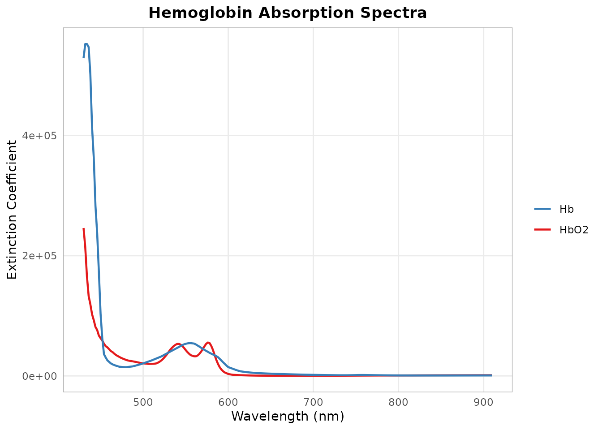
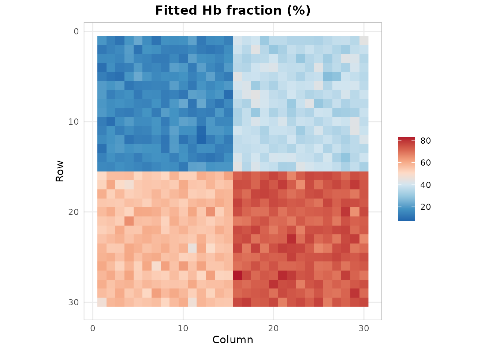
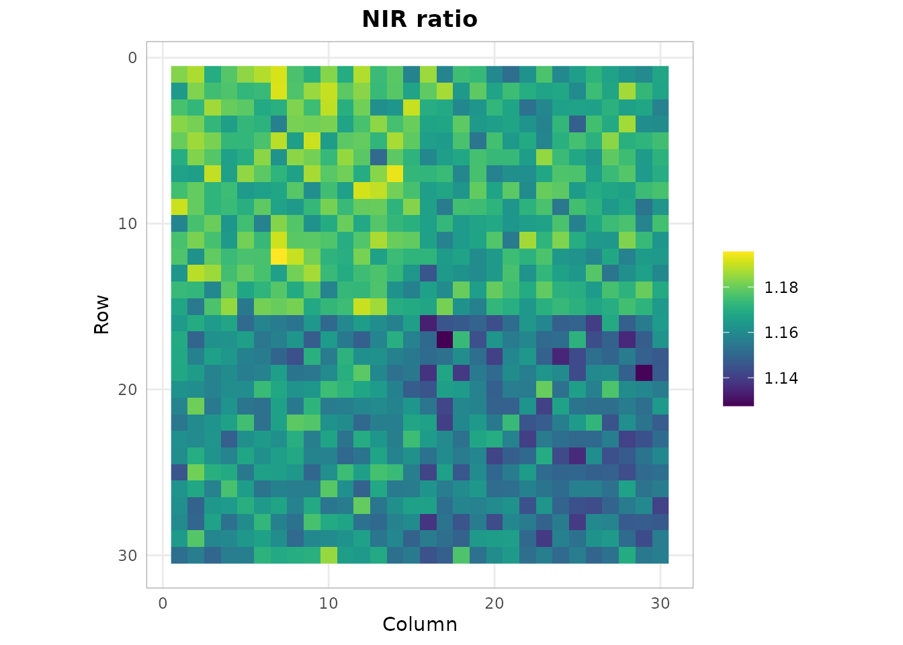
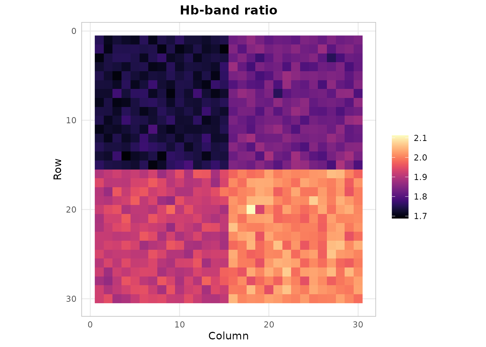
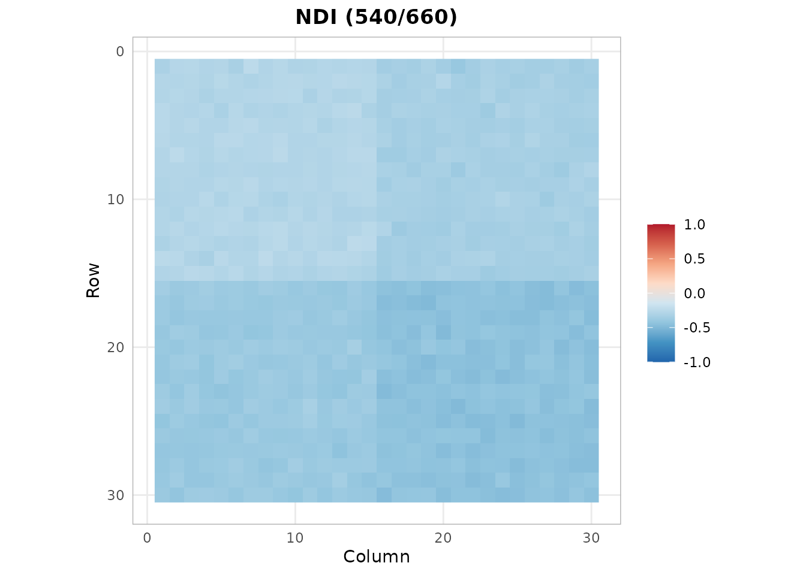
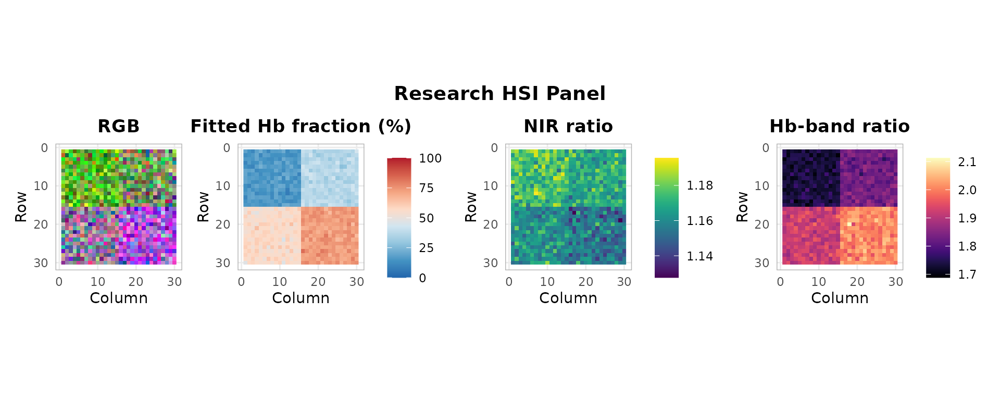

# Research Spectral Indices Explained

[](https://github.com/CTTIR/hyperspectR/actions/workflows/R-CMD-check.yaml)
[](https://cttir.github.io/hyperspectR/)
[](https://CRAN.R-project.org/package=hyperspectR)
[](https://app.codecov.io/gh/CTTIR/hyperspectR?branch=main)
[](https://cran.r-project.org/package=hyperspectR)
[](https://cran.r-project.org/package=hyperspectR)
[](https://opensource.org/licenses/MIT)
[](https://lifecycle.r-lib.org/articles/stages.html#experimental)

``` r

library(hyperspectR)
#> hyperspectR v0.2.0.9000 - Hyperspectral Imaging Analysis for Biomedical Applications
```

## Hemoglobin Absorption

Tissue oxygenation assessment via HSI relies on the distinct absorption
spectra of oxyhemoglobin (HbO2) and deoxyhemoglobin (Hb).

``` r

hb_data <- hs_chromophore_data(c("HbO2", "Hb"), wavelength_range = c(430, 910))
library(ggplot2)
ggplot(hb_data, aes(x = wavelength)) +
  geom_line(aes(y = HbO2, color = "HbO2"), linewidth = 0.8) +
  geom_line(aes(y = Hb, color = "Hb"), linewidth = 0.8) +
  scale_color_manual(values = c(HbO2 = "#E41A1C", Hb = "#377EB8")) +
  labs(x = "Wavelength (nm)", y = "Extinction Coefficient",
       title = "Hemoglobin Absorption Spectra", color = "") +
  theme_hsi()
```



## Tissue Oxygen Saturation (StO2)

[`hs_sto2()`](https://cttir.github.io/hyperspectR/dev/reference/hs_sto2.md)
reports the fitted HbO2 fraction using tabulated decadic extinction
coefficients. It assumes the stated Beer-Lambert model; it is not an
empirically validated measure of tissue oxygen saturation for a camera
or clinical task.

``` r

cube <- hs_example_cube()
sto2 <- hs_sto2(cube)
hs_plot_index(sto2, title = "Fitted Hb fraction (%)", palette = "sto2")
```



## Near-Infrared Perfusion Index (NPI)

The legacy NPI name returns an unscaled NIR band ratio. It has no
calibrated perfusion or depth interpretation.

``` r

npi <- hs_npi(cube)
hs_plot_index(npi, title = "NIR ratio", palette = "perfusion")
```



## Tissue Hemoglobin Index (THI)

The legacy THI name returns a dimensionless reference/Hb-band ratio. It
is not a concentration.

``` r

thi <- hs_thi(cube)
hs_plot_index(thi, title = "Hb-band ratio", palette = "hemoglobin")
```



## Custom Normalized Difference Index

Create any two-band ratio index:

``` r

ndi <- hs_ndi(cube, band1 = 540, band2 = 660)
hs_plot_index(ndi, title = "NDI (540/660)", range = c(-1, 1))
```



## Research Panel

The research panel combines RGB with model fractions and relative
indices. It does not reproduce vendor indices:

``` r

hs_plot_clinical(cube)
```


