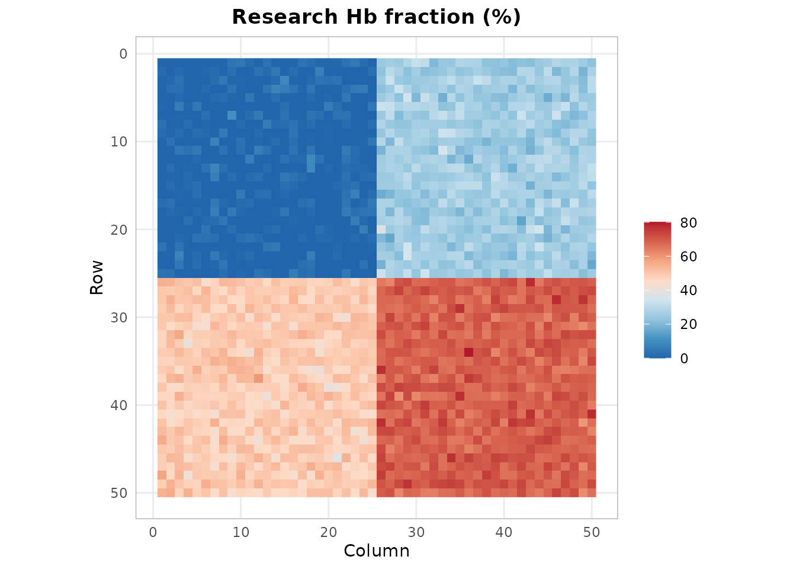
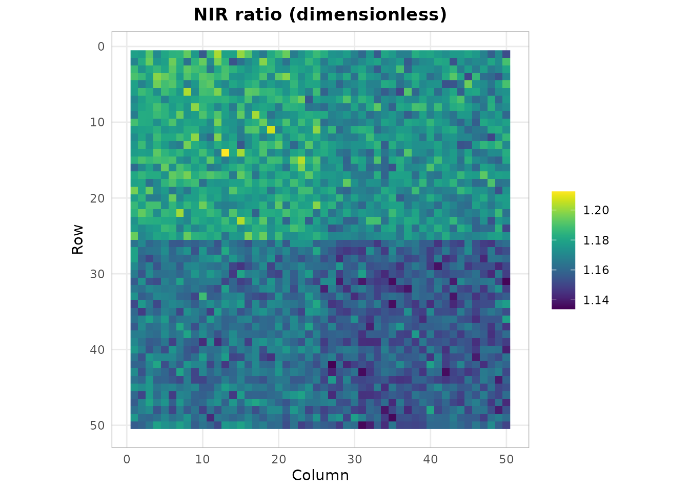
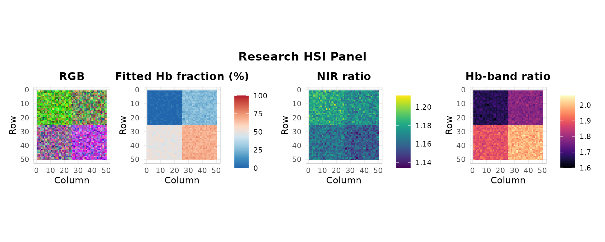
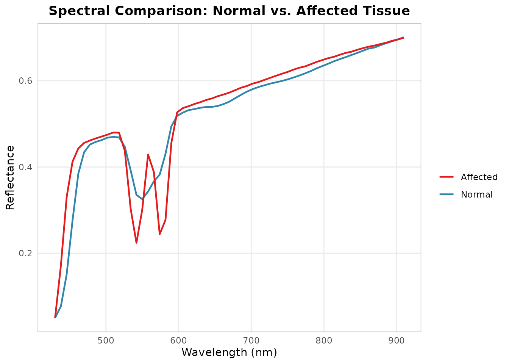

# Synthetic Regional Spectral Comparison

[](https://github.com/CTTIR/hyperspectR/actions/workflows/R-CMD-check.yaml)
[](https://cttir.github.io/hyperspectR/)
[](https://CRAN.R-project.org/package=hyperspectR)
[](https://app.codecov.io/gh/CTTIR/hyperspectR?branch=main)
[](https://cran.r-project.org/package=hyperspectR)
[](https://cran.r-project.org/package=hyperspectR)
[](https://opensource.org/licenses/MIT)
[](https://lifecycle.r-lib.org/articles/stages.html#experimental)

``` r

library(hyperspectR)
#> hyperspectR v0.2.0.9000 - Hyperspectral Imaging Analysis for Biomedical Applications
```

## Scope

This example compares regions in a synthetic image. The package has not
been validated to diagnose compartment syndrome, detect ischemia, or
replace clinical assessment. No clinical threshold is defined by these
simulated outputs.

## Simulating a Demonstration Scene

The region parameters vary synthetic spectral shapes. Their assigned
values are simulation inputs, not established tissue oxygenation ground
truth.

``` r

cube <- hs_simulate_cube(rows = 50, cols = 50, n_regions = 4,
                          sto2_range = c(0.15, 0.9), seed = 123)
```

## Tissue Oxygenation Mapping

``` r

sto2 <- hs_sto2(cube)
hs_plot_index(sto2, title = "Research Hb fraction (%)", palette = "sto2")
```



The fitted fractions may disagree with simulation parameters because the
simulator and reference inversion use different models.

## Perfusion Assessment

``` r

npi <- hs_npi(cube)
hs_plot_index(npi, title = "NIR ratio (dimensionless)", palette = "perfusion")
```



## Research Panel Overview

``` r

hs_plot_clinical(cube, indices = c("sto2", "npi", "thi"))
```



## ROI Comparison: Affected vs. Unaffected

``` r

roi_affected <- hs_roi_rect(cube, x_range = c(30, 50), y_range = c(30, 50))
roi_normal <- hs_roi_rect(cube, x_range = c(1, 20), y_range = c(1, 20))

stats_aff <- hs_roi_stats(cube, roi_affected)
stats_norm <- hs_roi_stats(cube, roi_normal)

library(ggplot2)
ggplot() +
  geom_line(data = stats_norm,
            aes(x = wavelength, y = mean, color = "Normal"), linewidth = 0.8) +
  geom_line(data = stats_aff,
            aes(x = wavelength, y = mean, color = "Affected"), linewidth = 0.8) +
  scale_color_manual(values = c(Normal = "#2E86AB", Affected = "#E41A1C")) +
  labs(x = "Wavelength (nm)", y = "Reflectance",
       title = "Spectral Comparison: Normal vs. Affected Tissue", color = "") +
  theme_hsi()
```



This plot describes within-image spectral variation. Pixel SD is not a
confidence interval for a population effect. For repeated measurements,
define subjects as independent groups and use
[`hs_group_summary()`](https://cttir.github.io/hyperspectR/dev/reference/hs_group_summary.md)
on prespecified ROI summaries.
