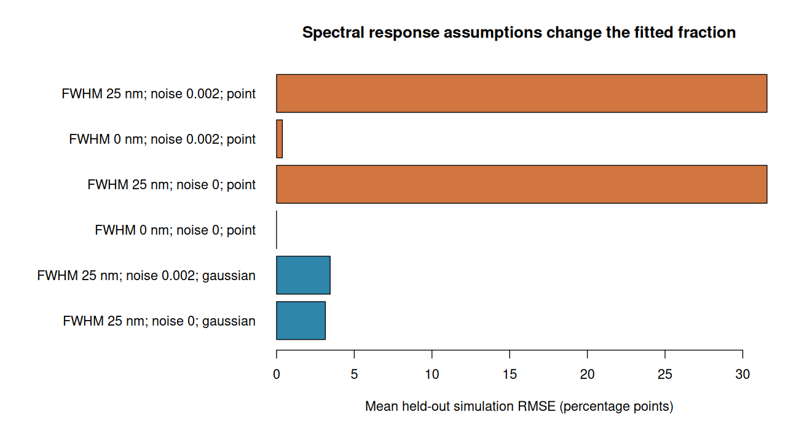

# Analysis results and limits

Recorded 2026-09-10 for hyperspectR 0.2.0.9000. The corrected methods pass the
implemented numerical checks, while the synthetic response experiment exposes
substantial sensitivity to the measurement model. These results support software
correctness under the stated assumptions; they do not establish tissue accuracy.

## Numerical recovery

The reference is the pinned Prahl HbO2/Hb table distributed with MNE-Python
v1.10.2, preserving its decadic molar-extinction units. The
[manifest](../inst/extdata/prahl-hemoglobin-v1.json) records provenance and
conversion. Runtime loading verifies MD5 `52710fd13196ed4aeaa00e3a32c0ac02`.

Independent forward calculations recover 0, 10, 30, 50, 70, 90 and 100% HbO2
fractions at three nonzero total coefficients within the asserted tolerance.
The test constructs absorbance directly from the table without the package
simulator. Equivalent declared reflectance and absorbance inputs agree; zero
Hb signal gives `no_hemoglobin_signal` and an NA fraction. Rank-deficient and
scaled NNLS fixtures check reconstruction and constraints rather than asserting
unique coefficients where they cannot be identified.

Exact arrays, hand-encoded ENVI bytes, polynomial SG expectations, masked
outliers and known constrained solutions provide separate engineering evidence.
See the [fixture registry](fixture-registry.md) and [finding register](finding-closure.md).

## Synthetic sensitivity experiment

The [script](../validation/model-sensitivity.R) fixes five fractions
(20, 35, 50, 65 and 80%), two reflectance-noise SDs (0 and 0.002), two true
response widths (point and Gaussian FWHM 25 nm), two additive offsets (0 and
0.02), and two gains (1 and 1.03). There are **80 acquisition cases**, each with
12 noise realizations, and **240 fitting configurations** across response
approximations and wavelength windows. Fractions 35 and 65% are designated
holdout before execution; fitting settings were not tuned on their results.

The forward calculation integrates high-resolution reflectance through the
response. The Gaussian inverse option averages reference extinction. Taking the
logarithm of averaged reflectance differs from averaging its logarithm, so this
broad-band inverse does not exactly match the forward measurement model.

For the prespecified holdout subset with gain 1, offset 0, and fitting support
500–600 nm, the mean of the two fraction-specific RMSEs is:

| True response | Noise SD | Fitted response | RMSE, percentage points |
|---|---:|---|---:|
| Point | 0 | Point | < 0.000001 |
| Point | 0.002 | Point | 0.372 |
| Gaussian, 25 nm FWHM | 0 | Point | 31.563 |
| Gaussian, 25 nm FWHM | 0.002 | Point | 31.561 |
| Gaussian, 25 nm FWHM | 0 | Gaussian approximation | 3.141 |
| Gaussian, 25 nm FWHM | 0.002 | Gaussian approximation | 3.450 |

All 240 configurations return finite fractions for all 12 pixels (2,880 outputs;
zero failed pixel fits). The worst case-specific RMSE across deliberate
perturbations is **55.330 percentage points**. Numerical convergence therefore
does not establish an accurate model. The Gaussian approximation reduces error
in this selected scenario but retains bias and has not been validated for a
real sensor.

The [complete results](../validation/results/sensitivity-results.csv) include
bias, RMSE, error quantiles, failed/total counts and conditioning for both fitting
ranges. [Configuration](../validation/results/sensitivity-config.csv),
[subset summary](../validation/results/sensitivity-summary.csv), and
[environment](../validation/results/sensitivity.txt) are retained. Noise-replicate
quantiles describe simulation variation, not subject confidence intervals.
No physiological uncertainty model or empirical coverage study is included.

## Reproducibility and statistical tools

Two fresh R processes produce `complete` and then `resumed` for the same batch
fixture. Input, recipe, implementation and environment changes invalidate resume.
The output retains input checksums, learned recipe, environment and model
diagnostics. Restoring historical dependencies remains an external step.

Grouped evaluation tests keep independent groups intact and estimate MSC
references within training folds. Evaluation includes prediction yield, class
metrics and a group-weighted accuracy interval. The bootstrap conditions on
existing out-of-fold predictions and does not repeat model selection. Group
summaries first average within a group and then weight groups equally. These
are software tests using constructed labels, not measured classifier performance
on a target population. An actual study must specify its independent unit,
repeated-measure structure and model-selection design.

## Runtime and memory baseline

Hardware: Intel Xeon w9-3475X, 36 physical cores / 72 logical CPUs; Linux x86_64,
R 4.6.1 and OpenBLAS. Each timing is one observation on this host without an
isolated benchmark or repeated-run design.

The benchmark uses two endmembers, 26 bands, no retained residual array, and
chunk sizes 256 and 10,000. All abundance and RMSE outputs agree.

| Cube shape | Chunk 256 | Chunk 10,000 | Input object | Result object |
|---|---:|---:|---:|---:|
| 16 × 16 × 26 | 0.030 s | 0.029 s | 59,248 bytes | 14,368 bytes |
| 32 × 32 × 26 | 0.116 s | 0.125 s | 225,136 bytes | 45,088 bytes |
| 64 × 64 × 26 | 0.499 s | 0.468 s | 888,688 bytes | 167,968 bytes |

Whole-process peak RSS is **148,364 KiB**, with 2.62 seconds wall time for the
entire script. This includes R/library overhead and is not per-fit peak memory.
Object sizes exclude temporary allocations. These small inputs establish a
baseline and chunk equivalence; they do not establish megapixel latency/memory
limits or a speed advantage from chunking.

See [measurements](../validation/results/performance.csv),
[process resource report](../validation/results/performance-process.txt), and
[environment](../validation/results/performance-environment.txt).

## Evidence still needed

Measured sensor response/noise, real raw/dark/white acquisitions, known phantoms,
and independent grouped recordings are unavailable. Scattering/baseline and
regularization candidates need an approved model definition and development
data before comparison. Repeated-measures agreement, empirical interval coverage,
device/site generalization and clinical thresholds remain unestablished. The
[external validation handoff](external-validation.md) specifies the acquisition
fields, reviewers and decisions needed for those stages.
